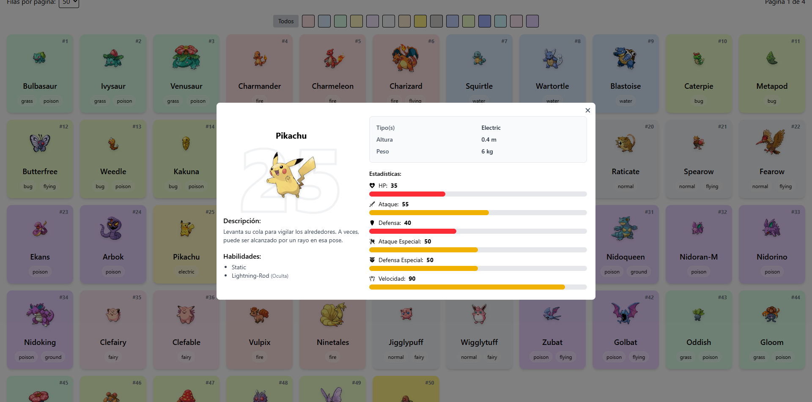

# Pokémon Explorer

Aplicación web para explorar Pokémon de la primera generación. Permite visualizar los Pokémon en formato de **tabla o cuadrícula**, acceder a sus **estadísticas detalladas, habilidades, descripciones**, y aplicar **filtros por tipo de color**, todo con una interfaz visualmente atractiva y responsiva.

🔗 **Deploy**:  
👉 [pokemon-explorer-ivory.vercel.app](https://pokemon-explorer-ivory.vercel.app/)

---

## 📸 Screenshot



---

## ⚙️ Tecnologías utilizadas

- [React](https://reactjs.org/) + [TypeScript](https://www.typescriptlang.org/)
- [Tailwind CSS](https://tailwindcss.com/)
- [Framer Motion](https://www.framer.com/motion/)
- [React Icons](https://react-icons.github.io/react-icons/)
- [React Paginate](https://www.npmjs.com/package/react-paginate)
- [React Data Table Component](https://www.npmjs.com/package/react-data-table-component)
- [PokéAPI](https://pokeapi.co/)

---

## 🚀 Cómo ejecutar el proyecto localmente

1. **Clona el repositorio**

```bash
git clone https://github.com/luisrapalino/pokemon-explorer.git
cd pokemon-explorer
```
2. **Instala las dependencias**

```bash
npm install
```
3. **Ejecuta el proyecto en modo desarrollo**

```bash
npm run dev
```
4. Abre en tu navegador http://localhost:5173
